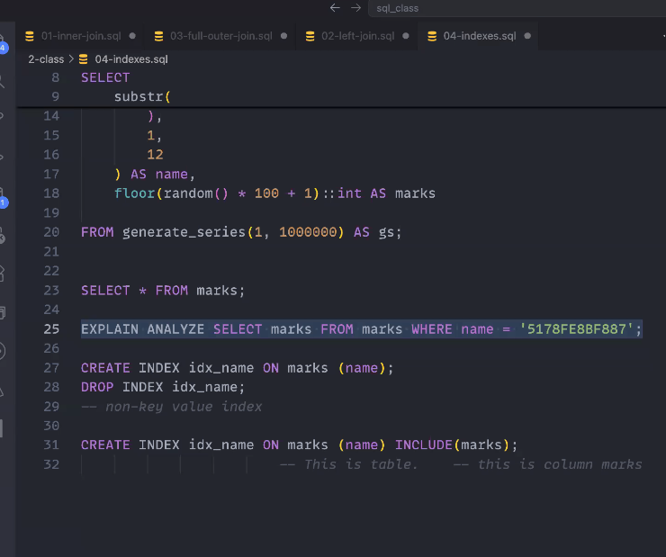
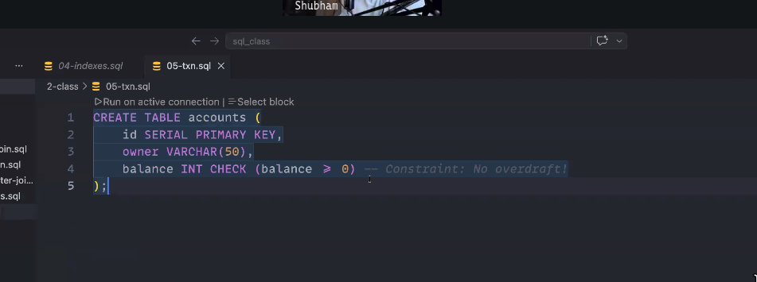
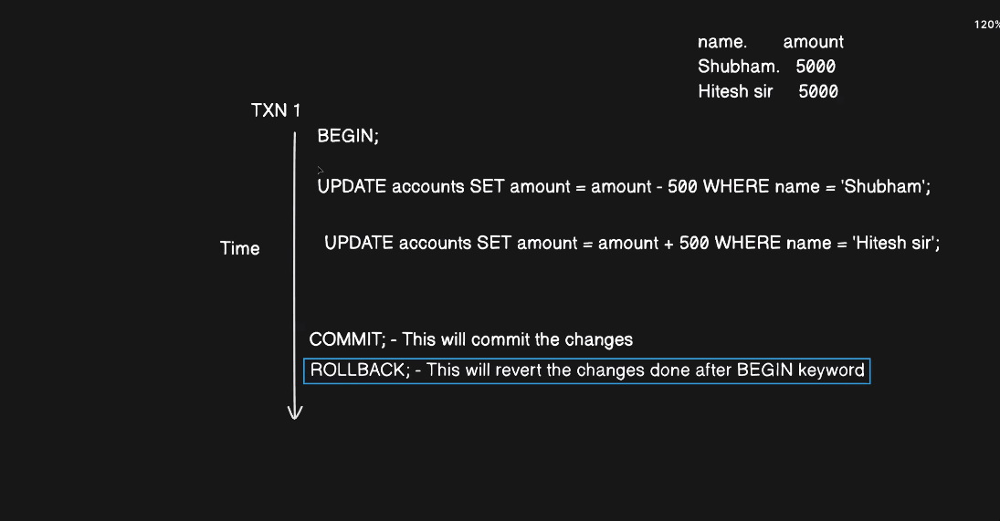

# Structured Query Language

```sql
-- Creating table of student with all the values mention
CREATE TABLE students (
    student_id SERIAL PRIMARY KEY, -- serial PRIMARY KEY;
    first_name VARCHAR(50) NOT NULL,
    last_name VARCHAR(50) NOT NULL,

    email VARCHAR(322) UNIQUE NOT NULL,

    phone_number VARCHAR(10) UNIQUE, -- INT will save 4 byte vs  VARCHAR save 10byte vs BIGINT -> 8 btye 

    -- INT in Postgress is 4byte integer 4 byte = 32 = 2^32 = 4 Billion
    -- BigInt 8 Byte = 64bit  = 2^64;

    age INT CHECK(age > 12),
    current_status VARCHAR(20) DEFAULT 'active' CHECK(current_status IN ('active', 'graduated','droppedout')), 
    has_joined_masterji BOOLEAN DEFAULT FALSE, 
    current_score INT DEFAULT 0,
    enrollment_date DATE DEFAULT CURRENT_DATE 
);

ALTER TABLE students
ADD COLUMN batch_name VARCHAR(50) DEFAULT 'Web Dev 2025';


CREATE TABLE ipl_team (
    player_id SERIAL PRIMARY KEY,
    name VARCHAR(100) NOT NULL,
    team VARCHAR(200),
    role VARCHAR(50) NOT NULL,
    runs_scored INT CHECK(runs_scored > 0),
    wicket_taken INT CHECK(wicket_taken > 0),
    auction_price_crores INT

);

ALTER TABLE ipl_team
ADD CONSTRAINT wicket_taken_check CHECK (wicket_taken >= 0);

ALTER TABLE ipl_team
ADD CONSTRAINT runs_scored_check CHECK (runs_scored >= 0);

-- INSERT DATA TO TBALE ********************************************

INSERT INTO ipl_team (name, team, role, runs_scored, wicket_taken, auction_price_crores) VALUES
('Virat Kohli','RCB','Batsman',7263,4,15.00),
('Rohit Sharma','MI','Batsman',6211,15,16.00),
('MS Dhoni','CSK','Wicket-Keeper',5082,0,12.00),
('KL Rahul','LSG','Batsman',4163,0,17.00),
('David Warner','DC','Batsman',6397,0,6.25),
('Shikhar Dhawan','PBKS','Batsman',6617,4,8.25),
('Jos Buttler','RR','Wicket-Keeper',3582,0,10.00),
('Hardik Pandya','MI','All-Rounder',2309,53,15.00),
('Ravindra Jadeja','CSK','All-Rounder',2692,152,16.00),
('Andre Russell','KKR','All-Rounder',2262,96,12.00),
('Sunil Narine','KKR','All-Rounder',1046,163,6.00),
('Rashid Khan','GT','Bowler',400,149,15.00),
('Jasprit Bumrah','MI','Bowler',56,145,12.00),
('Mohammed Shami','GT','Bowler',69,127,6.25),
('Bhuvneshwar Kumar','SRH','Bowler',300,170,4.20),
('Yuzvendra Chahal','RR','Bowler',37,187,6.50),
('Kuldeep Yadav','DC','Bowler',120,87,2.00),
('Ruturaj Gaikwad','CSK','Batsman',2380,0,6.00),
('Devdutt Padikkal','RR','Batsman',1521,0,7.75),
('Shubman Gill','GT','Batsman',2790,0,8.00),
('Ishan Kishan','MI','Wicket-Keeper',2324,0,15.25),
('Sanju Samson','RR','Wicket-Keeper',3888,0,14.00),
('Dinesh Karthik','RCB','Wicket-Keeper',4516,0,5.50),
('Axar Patel','DC','All-Rounder',1350,112,9.00),
('Washington Sundar','SRH','All-Rounder',378,35,8.75),
('Mitchell Starc','KKR','Bowler',95,51,24.75),
('Pat Cummins','SRH','All-Rounder',379,45,20.50),
('Glenn Maxwell','RCB','All-Rounder',2719,31,11.00),
('Faf du Plessis','RCB','Batsman',4133,0,7.00),
('Quinton de Kock','LSG','Wicket-Keeper',3157,0,6.75);

-- Searching based on words
SELECT * FROM ipl_team WHERE name LIKE '__s%';
SELECT * FROM ipl_team WHERE name ILIKE '__s%'; -- Case in sensitive
SELECT * FROM ipl_team WHERE team IN ('CSK','MI','RR');
SELECT * FROM ipl_team WHERE team = 'CSK' OR team = 'RCB'; -- OR 
SELECT * FROM ipl_team WHERE wicket_taken > 10 AND role ='All-Rounder'; -- AND
SELECT * FROM ipl_team WHERE TEAM != 'RCB'; -- Not Equal to 
SELECT * FROM ipl_team WHERE TEAM <> 'RCB'; -- Not Equal to also 
--- SORTING
SELECT name, auction_price_crores FROM ipl_team ORDER BY auction_price_crores DESC; 
SELECT name, auction_price_crores FROM ipl_team ORDER BY auction_price_crores ASC; 
-- Multi column sorting first sorting team and then sorting auction_price_crores
SELECT name, auction_price_crores FROM ipl_team ORDER BY team ASC , auction_price_crores DESC;

-- Pagination ************************

SELECT name, auction_price_crores
FROM ipl_team
ORDER BY auction_price_crores DESC
LIMIT 10 OFFSET 3;

-- Alias  ************************
SELECT name, auction_price_crores , (auction_price_crores * 100) AS auction_price_lakhs 
FROM ipl_team 
LIMIT 10;


--DISTINCT VALUES
SELECT DISTINCT role from ipl_team
```

<hr>

## Creating

```sql


-- CREATING TABLE
CREATE TABLE canteen_menu (
 item_id SERIAL PRIMARY KEY,
 item_name VARCHAR(100),
 category VARCHAR(50),
 price int,
 is_available BOOLEAN DEFAULT TRUE
)

```
<hr>

## INSERTING 

```sql

-- INSERTING VALUE
INSERT INTO canteen_menu (item_name, category, price)-- This paranthisis ask for name of the column in which you want to add the values
VALUES
('Masal Chai','Beverages', 10 ), -- This will take the value in the same order like first item_name and then category and then price 
('Burger','Snack', 80 ), -- This will take the value in the same order like first item_name and then category and then price 
('Pizza','Snack', 180 ),
('Cold Coffee','Beverages', 180 );
```

<hr>

## UPDATE 
```sql

-- UPDATING VALUE 
UPDATE canteen_menu
SET price = 20  -- Jisko Set krna hia 
WHERE item_name = 'Burger' -- and using where to  deifne whose price will be updated you  can also  use Id to specify 

UPDATE canteen_menu
SET price = price - 5
where category = 'Beverages';
```


<hr>

## DELETE
```sql
DELETE FROM canteen_menu
WHERE item_name = 'Cold Coffee';

```

>  NEVER Use Delete without where, wrna (table khali ho jayega)  


<hr>

## Aggregation

```sql
SELECT COUNT(*) as total_rows FROM ipl_team; -- Return the number of rows 
SELECT SUM(auction_price_crores) as total_auction_pool FROM ipl_team; -- Return the sun of auction_price_crores 
SELECT SUM (runs_scored * wicket_taken) as faltu_Calculation FROM ipl_team -- Multiply the runs_scored and wicket_taken

-- Average

SELECT AVG(auction_price_crores) as average_auction_price FROM ipl_team; -- Average milega auction_price_crores ka.

SELECT MIN(auction_price_crores) as min_auction_price FROM ipl_team;
SELECT MAX(auction_price_crores) as max_auction_price FROM ipl_team;
```


<hr>

## GROUP BY
```sql
SELECT team, SUM(auction_price_crores) FROM ipl_team
GROUP BY team
-- Aggregation based on group (team)

-- Merg same team and then perform Sum on there auction_price_crores column
-- Same we can apply MIN, MAX, AVG, COUNT

SELECT team, COUNT(auction_price_crores) FROM ipl_team
GROUP BY team


SELECT team, MIN(auction_price_crores) FROM ipl_team
GROUP BY team


SELECT team, MAX(auction_price_crores) FROM ipl_team
GROUP BY team


SELECT team, AVG(auction_price_crores) FROM ipl_team
GROUP BY team

SELECT team, SUM(auction_price_crores) as total_auction_price FROM ipl_team
GROUP BY team
ORDER BY total_auction_price ASC

--- Multi Column
SELECT team, name , SUM(auction_price_crores) as total_auction_price from ipl_team
GROUP BY team, name,
ORDER BY total_auction_price DESC

```

> Using Having Keyword (Study For this its where clause for GROUP BY) 

<hr>

## IN Operator
- Include the values from a result set
```sql
SELECT * FROM ipl_team WHERE team IN ('CSK','MI','RR');
```

<hr>

## NOT IN Operator
- `NOT IN` in SQL is used to exclude values from a result set
```sql

SELECT team, name FROM ipl_team
WHERE team NOT IN ('MI', 'CSK','KKR')
```

<hr>

## Between Operator
The BETWEEN operator in SQL is used to filter values within a range (inclusive).

```sql
select name, price from products
where price BETWEEN 20 AND 100
```

<hr>

## Like Pattern Matching
Helps you to filter out the result based on some pattern, 
like here I  wanted the result where the name start with `A` 
To do so sql uses `%` with the char you want to check,
You can check 1st letter or second letter or 3rd letter or nth letter of the name 
`LIKE` is case sensitive
```sql
SELECT team, name from ipl_team
WHERE name LIKE 'A%';

-- Search by Second char 
SELECT team, name from ipl_team
WHERE name LIKE '_s%'  -- Return those result where the name will have 2nd letter as s 
```

<hr>

## IS NULL
TO check if the value is null;
```sql
SELECT wicket_taken FROM ipl_team 
WHERE wicket_taken IS NULL
```

<hr>

## IS NOT NULL
To check if the value is not null;
```sql
SELECT wicket_taken FROM ipl_team
WHERE wicket_taken IS NOT NULL
```
<hr>

## HAVING 
`HAVING` is used to filter grouped result (after`GROUP BY`) 
 - `Where` -> Filters rows before grouping
 - `HAVING` -> Filter groups after Aggregation
 ```sql

SELECT column, AGG_FUNCTION(column)
FROM table
GROUP BY column
HAVING condition;
 ```

 <hr>
 
# Second Class Start Here 

## JOIN 
- Types of JOIN in sql 
1. LEFT JOIN (Left outer Join)
1. RIGHT JOIN (Right outer Join)
3. INNER JOIN
1. FULL OUTER JOIN

```sql

CREATE TABLE students (
    student_id SERIAL PRIMARY KEY,
    name VARCHAR(100),
    email VARCHAR(100),
    branch VARCHAR(50)
)

CREATE TABLE internships (
    internship_id SERIAL PRIMARY,
    company_name VARCHAR(100),
    role VARCHAR(50),
    stipend INT CHECK(stipend > 1000),
    status VARCHAR(20), -- Selected / Pending / Rejected
    -- Relation to STUDENT
    student_id INT REFERENCES students(student_id) ON DELETE CASCADE -- This is Called Forign Key Which connects one table with another  
-- ON DELETE CASCADE means if student deleted its related internship will also get deleted  
-- ON DELETE SET NULL means make related table rows to NULL
-- ON DELETE RESTRICT means You cann't delete the student  
)
--******************** DOING INNER JOIN ********************
SELECT
students.name, 
students.branch, 
internships.company_name,
internships.role,
internships.stipend
FROM students
INNER JOIN internships ON students.student_id = internships.student_id
```


_output of inner Join_

|     name      |         branch         | company_name |           role           | stipend | 
|---------------|------------------------|--------------|--------------------------|---------|
| Amit Sharma   | Computer Science       | Google       | Software Engineer Intern |   50000  |
| Priya Verma   | Information Technology | Microsoft    | Backend Intern           |   45000  |
| Rahul Singh   | Mechanical             | Amazon       | Cloud Intern             |   40000  |
| Sneha Gupta   | Electrical             | Infosys      | System Engineer Intern   |   15000  |
| Vikram Yadav  | Civil                  | TCS          | Developer Intern         |   12000  |
| Anjali Mishra | Computer Science       | Wipro        | QA Intern                |   10000  |
| Rohit Kumar   | Electronics            | Flipkart     | Frontend Intern          |   30000  |
| Neha Patel    | Information Technology | Zomato       | Data Analyst Intern      |   25000  |
| Karan Mehta   | Mechanical             | Paytm        | Full Stack Intern        |   28000  |
| Pooja Singh   | Civil                  | Swiggy       | DevOps Intern            |   27000  |

<hr>

```sql

-- Query
 SELECT s.*, i.company_name 
 from students as s
 INNER JOIN internships AS i ON s.student_id = i.student_id;

-- OUTPUT

 student_id |     name      |           email           |         branch         | company_name
------------+---------------+---------------------------+------------------------+--------------
          1 | Amit Sharma   | amit.sharma@example.com   | Computer Science       | Google
          2 | Priya Verma   | priya.verma@example.com   | Information Technology | Microsoft
          3 | Rahul Singh   | rahul.singh@example.com   | Mechanical             | Amazon
          4 | Sneha Gupta   | sneha.gupta@example.com   | Electrical             | Infosys
          5 | Vikram Yadav  | vikram.yadav@example.com  | Civil                  | TCS
          6 | Anjali Mishra | anjali.mishra@example.com | Computer Science       | Wipro
          7 | Rohit Kumar   | rohit.kumar@example.com   | Electronics            | Flipkart
          8 | Neha Patel    | neha.patel@example.com    | Information Technology | Zomato
          9 | Karan Mehta   | karan.mehta@example.com   | Mechanical             | Paytm
         10 | Pooja Singh   | pooja.singh@example.com   | Civil                  | Swiggy
(10 rows)

```


<hr>

## LEFT JOIN

```sql
-- LEFT JOIN QUERY
SELECT
s.name, 
s.branch,
i.company_name,
i.stipend
FROM internships AS i
LEFT JOIN students as s ON i.student_id = s.student_id

-- OUTPUT of this query
-- LEft join give all the data from LEFT SIDE

     name      |         branch         | company_name | stipend
---------------+------------------------+--------------+---------
 Amit Sharma   | Computer Science       | Google       |   50000
 Priya Verma   | Information Technology | Microsoft    |   45000
 Rahul Singh   | Mechanical             | Amazon       |   40000
 Sneha Gupta   | Electrical             | Infosys      |   15000
 Vikram Yadav  | Civil                  | TCS          |   12000
 Anjali Mishra | Computer Science       | Wipro        |   10000
 Rohit Kumar   | Electronics            | Flipkart     |   30000
 Neha Patel    | Information Technology | Zomato       |   25000
 Karan Mehta   | Mechanical             | Paytm        |   28000
 Pooja Singh   | Civil                  | Swiggy       |   27000
```

<hr>

## RIGHT JOIN

```sql
-- RIGHT JOIN QUERY
SELECT
s.name, 
s.branch,
i.company_name,
i.stipend
FROM students AS s
RIGHT JOIN internships as i ON s.student_id = i.student_id
-- OUTPUT OF RIGHT JOIN
-- RIGHT GIVE ALL THE DATA FROM RIGHT TABLE 

     name      |         branch         | company_name | stipend
---------------+------------------------+--------------+---------
 Amit Sharma   | Computer Science       | Google       |   50000
 Priya Verma   | Information Technology | Microsoft    |   45000
 Rahul Singh   | Mechanical             | Amazon       |   40000
 Sneha Gupta   | Electrical             | Infosys      |   15000
 Vikram Yadav  | Civil                  | TCS          |   12000
 Anjali Mishra | Computer Science       | Wipro        |   10000
 Rohit Kumar   | Electronics            | Flipkart     |   30000
 Neha Patel    | Information Technology | Zomato       |   25000
 Karan Mehta   | Mechanical             | Paytm        |   28000
 Pooja Singh   | Civil                  | Swiggy       |   27000

```
<hr>

## FULL OUTER JOIN
- Give all the data from both the table
```sql

SELECT
s.name as student_name, 
s.branch,
i.company_name,
i.stipend
FROM students AS s
FULL OUTER JOIN internships as i ON s.student_id = i.student_id


-- OUTPUT

 student_name  |         branch         | company_name | stipend 
---------------+------------------------+--------------+---------
 Amit Sharma   | Computer Science       | Google       |   50000
 Priya Verma   | Information Technology | Microsoft    |   45000
 Rahul Singh   | Mechanical             | Amazon       |   40000
 Sneha Gupta   | Electrical             | Infosys      |   15000
 Vikram Yadav  | Civil                  | TCS          |   12000
 Anjali Mishra | Computer Science       | Wipro        |   10000
 Rohit Kumar   | Electronics            | Flipkart     |   30000
 Neha Patel    | Information Technology | Zomato       |   25000
 Karan Mehta   | Mechanical             | Paytm        |   28000
 Pooja Singh   | Civil                  | Swiggy       |   27000
 Pooja Singh   | Civil                  |              |        
 Amit Sharma   | Computer Science       |              |        
 Rohit Kumar   | Electronics            |              |        
 Priya Verma   | Information Technology |              |        
 Neha Patel    | Information Technology |              |        
 Vikram Yadav  | Civil                  |              |        
 Rahul Singh   | Mechanical             |              |        
 Karan Mehta   | Mechanical             |              |        
 Anjali Mishra | Computer Science       |              |        
 Sneha Gupta   | Electrical             |              |        
```


# INDEXES
- Tells DB that that data you want is exist in which corner of the Database.  
- Just like index of a book or dictionary 

```sql

EXPLAIN ANALYSE SELECT * FROM students where name ='Amit Sharma'
-- EXPLAIN ANALYSE Give you db inside that how much time a query took to execute
```


## Creating INDEX
```sql
CREATE INDEX idx_name ON marks (name);
-- Create index named idx_name ON marks table name column
-- Draw back Lock the table does not allow you to read or write the table until the indexing is finished


-- Creating index without locking the table  
CREATE INDEX CONCURRENTLY idx_name ON marks (name);

CREATE INDEX idx_name on makrs(name) INCLUDE (marks);
-- Included marks column into the index storage (for non-key value index)
-- To drop the idx_name index 

DROP INDEX idx_name
```

<hr>


<hr>


# Transactions 
- Queries run in group if any of the query failed the whole transction is failed, means none of the query will
  complete.
- You use it when you have to run queries such that one query run and only after first one is successfull then only
  the second one should run then we use `transction` 


<hr>

__TABLE__


<hr>

__How to write transactions__

```sql
BEGIN; -- Transactions Starts from here
UPDATE accounts SET balance = balance - 500 
WHERE owner = 'Saif';
UPDATE accounts SET balance = balance + 500 
WHERE owner = "Shikhar"
-- Still Transactions is not over  so db won't be updated
COMMIT;
-- Now transction is over and DB will be updated
```


Transactions is bepicted via `*#` on the sql shell.


<hr>



<hr>

> Mnnn Kre to dekh lena ye topic `Non-Repeatable Read, Phantom Read`


